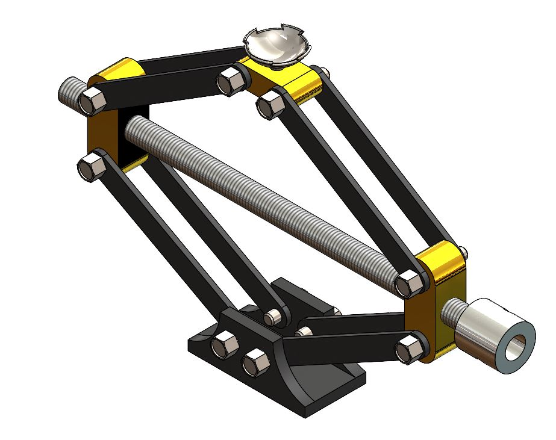

# Scissor Jack Design

## Project Overview
A manually operated Scissor Jack designed using SolidWorks.
This project includes 3D part modeling, assembly, exploded view, BOM, and manufacturing drawings.

## Technical Specifications
- Material: Mild Steel
- Software: SolidWorks 2025
- Assembly Parts: 10
- Drawing Standard: ISO

## Features
- 3D Part Modeling
- Assembly Design
- Motion Mechanism
- BOM Creation
- 2D Drawing

## Files
- 📄 Scissor_Jack_Isometric.pdf
- 📄 Scissor_Jack_BOM.pdf
- 🖼️ Scissor_Jack_Render.JPG

## Future Improvements
- Motion Study
- FEA Analysis
- Detailed Manufacturing Drawings
